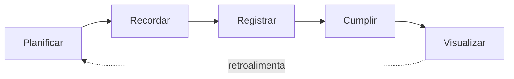

# 00 — Product Vision

## Problema

Las personas que quieren mejorar su relación con la comida no necesitan, en una primera etapa, contar calorías ni recibir recomendaciones médicas. Necesitan algo más simple: **decidir con antelación cuándo van a comer, recordarlo, y llevar un registro honesto de lo que realmente comieron**, para poder ver con el tiempo si están siendo consistentes con sus propias intenciones.

Las apps de nutrición tradicionales fallan aquí porque empiezan pidiendo demasiado (macros, calorías, objetivos numéricos) antes de que el usuario tenga el hábito básico de *planificar → registrar*.

## Usuario objetivo

Una persona (inicialmente, un único usuario individual, sin funciones sociales) que quiere:

* Crear una estructura simple de comidas (desayuno, comida, cena, snacks, agua, etc.).
* Recibir recordatorios opcionales.
* Registrar lo que comió de forma rápida, con o sin foto.
* Ver, de un vistazo, si está cumpliendo lo que se propuso.

No es un atleta de alto rendimiento ni un paciente con una condición médica. Es alguien que busca **constancia (consistency)**, no precisión nutricional.

## Propuesta de valor

> "Planifica tus comidas, que la app te lo recuerde, registra lo que realmente comiste, y observa tu constancia — sin fricción, sin contar calorías."

El valor no está en el dato nutricional, sino en el **ciclo de intención vs. realidad**.

## Acción principal (primary action)

```text
Record Meal (Registrar comida)
```

Es la acción más importante del producto y debe ser accesible en 1 toque desde la pantalla principal (Home).

## Ciclo principal del producto



* **Planificar**: el usuario crea un `MealPlan` (intención/rutina).
* **Recordar**: el sistema genera notificaciones locales opcionales.
* **Registrar**: el usuario crea un `MealLog` (lo que realmente comió).
* **Cumplir**: el dominio evalúa si el `MealLog` satisface la `MealOccurrence` planeada.
* **Visualizar**: el usuario ve su cumplimiento en el Dashboard y en el calendario de constancia.

## Qué NO pretende ser la aplicación (en esta etapa)

* No es un contador de calorías.
* No es una app de macronutrientes.
* No es una red social de comida.
* No da recomendaciones médicas ni nutricionales personalizadas.
* No usa IA todavía (solo se deja el punto de extensión preparado).
* No integra Apple Watch en el MVP.
* No es una plataforma para nutricionistas.

## Métrica de éxito conceptual (para orientar decisiones, no para implementar aún)

Un buen indicador cualitativo del éxito del producto sería: *"¿El usuario abre la app principalmente para registrar comidas, sin fricción, y vuelve a verla para revisar su constancia?"* Esto no se implementa como analítica en el MVP, pero orienta las prioridades de diseño (la acción de registrar debe ser la más rápida y visible de toda la app).
