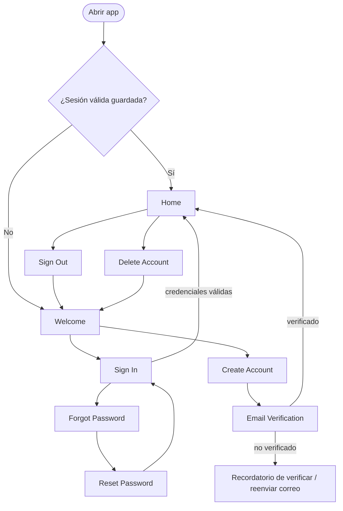
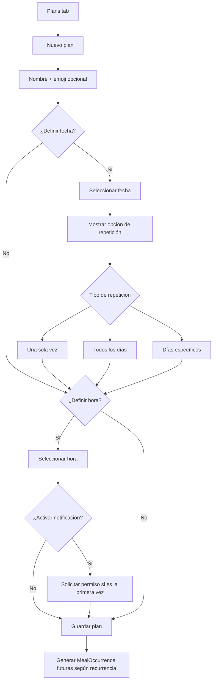
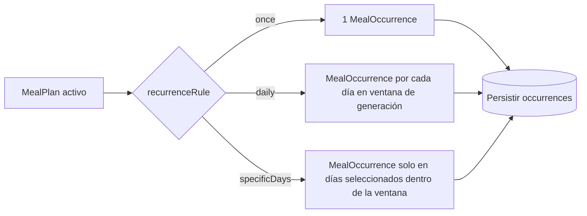
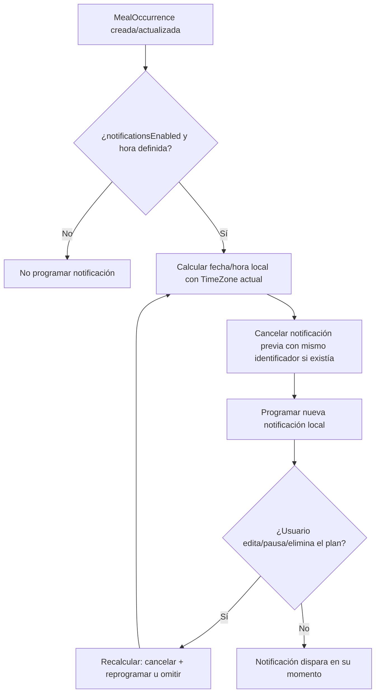
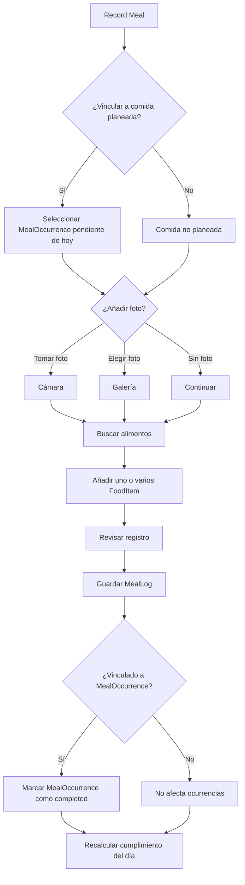
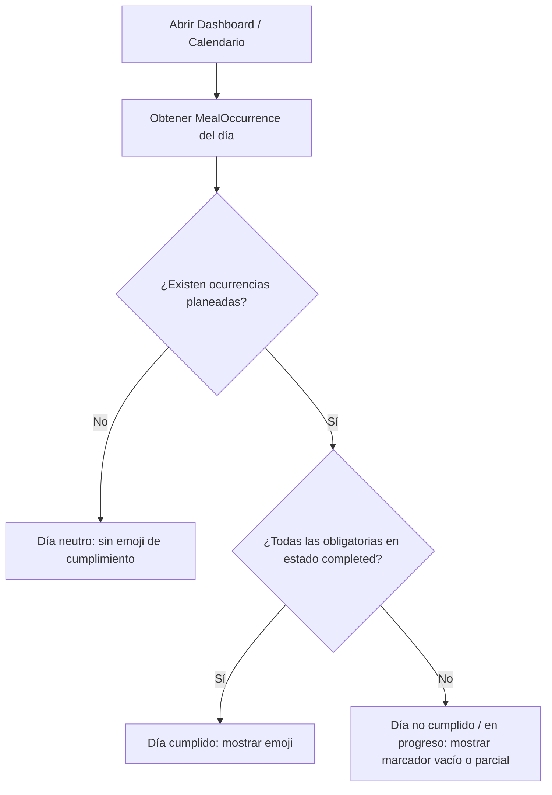
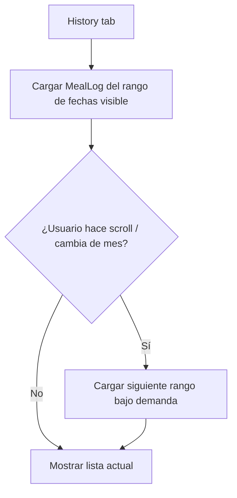

# 03 — User Flows

## Autenticación

## Creación de plan de alimentación

## Recurrencia (generación de ocurrencias)

## Recordatorio (ciclo de vida de una notificación)

## Registro de comida (Record Meal)

## Cumplimiento diario

## Historial

