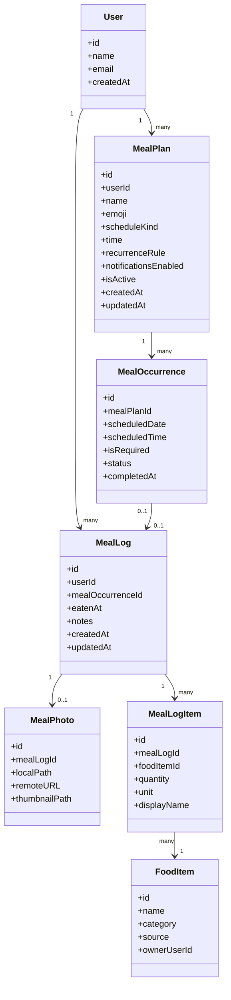
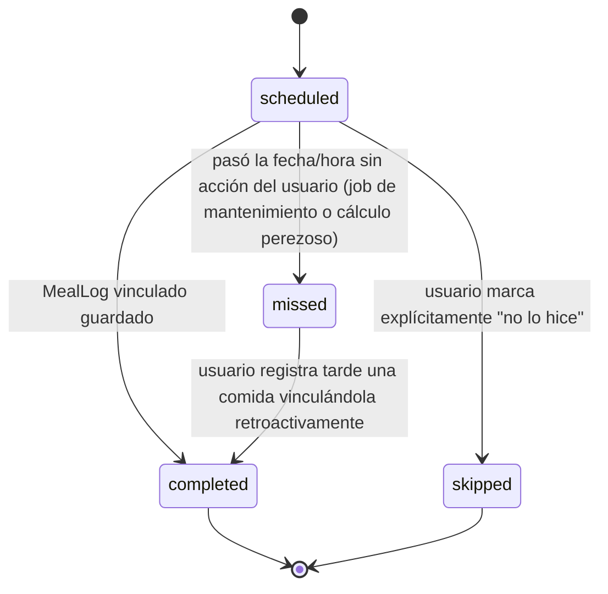

# 04 — Domain Model

## 1. Entidades y su responsabilidad

El modelo propuesto en el brief (`MealPlan → MealOccurrence → MealLog`) es correcto en su principio de separación y **se conserva**, porque resuelve exactamente el problema que se pidió evitar: mezclar intención, instancia concreta y realidad. Sin embargo, el modelo detallado de campos tiene varios problemas que se corrigen abajo.



## 2. Correcciones sobre el modelo propuesto

### 2.1 `date` y `time` como campos sueltos en `MealPlan` → problemático

Tener `date?` y `time?` como dos campos independientes obliga a interpretar 4 combinaciones (ver sección 3, la ambigüedad ya fue detectada correctamente en el brief). Se introduce un campo explícito **`scheduleKind`** (value object / enum) que documenta la intención en vez de inferirla:

```text
scheduleKind:
    routine          // sin fecha, puede tener hora o no (rutina general)
    oneTimeGoal       // fecha concreta, sin hora
    scheduledMeal     // fecha (o recurrencia) + hora concreta
```

Esto evita que la capa de UI o de notificaciones tenga que "adivinar" el significado combinando dos booleanos opcionales. Es un cambio pequeño y de bajo coste que elimina ambigüedad futura.

### 2.2 `MealOccurrence.status` necesita distinguir "obligatoria" de "opcional"

El brief no aclara si todas las `MealOccurrence` de un día cuentan para el cumplimiento. Se añade `isRequired: Bool` (por defecto `true`), pensando en casos futuros como "Tomar agua" que quizá no deba bloquear el cumplimiento del día. Esto no es sobreingeniería: es un campo booleano trivial que evita rediseñar la política de cumplimiento más adelante.

### 2.3 `FoodItem.source` necesita más definición

`source` debe ser un enum, no un string libre:

```text
source: local | remote | userCreated
```

Y se añade `ownerUserId: String?` — nulo para catálogo global (local/remote), con valor para alimentos creados por un usuario. Esto es necesario para el aislamiento de datos (ver 11-SECURITY-AND-PRIVACY.md): un `FoodItem` creado por el usuario A no debe aparecer en las búsquedas del usuario B.

### 2.4 Campos derivados que NO deben persistirse

* **Cumplimiento diario**: no es una entidad ni un campo persistido. Se calcula (ver sección 5). Guardarlo generaría una segunda fuente de verdad que puede desincronizarse.
* **`MealPlan.updatedAt` derivado de ediciones de recurrencia**: se mantiene como metadato de auditoría, no como dato de negocio.

### 2.5 `MealLog.photo?` no debe ser un campo embebido

En el modelo original, `photo?` aparece como campo de `MealLog`, pero en el diagrama de entidades aparece `MealPhoto` como entidad aparte. Se resuelve la contradicción: **`MealPhoto` es una entidad propia** relacionada 1-a-0/1 con `MealLog`, porque tiene su propio ciclo de vida (compresión, miniatura, subida, caché, posible reemplazo) independiente del `MealLog` en sí. Ver 10-IMAGE-ARCHITECTURE.md.

### 2.6 `MealLogItem` necesita un campo de "nombre mostrado" desacoplado del catálogo

Si el usuario busca "Huevo" y el `FoodItem` canónico cambia de nombre después (por ejemplo al sincronizar con un catálogo remoto más adelante), el registro histórico no debería cambiar retroactivamente lo que el usuario vio al momento de guardar. Se añade `displayName: String` (copiado en el momento de guardar) para preservar la integridad histórica del registro. Este es un patrón común en dominios de "registro de hechos" (event-sourcing-like snapshot), aplicado aquí de forma mínima.

### 2.7 Entidad que falta: `RecurrenceRule` como value object

`recurrenceRule` no debería ser un string libre. Se define como un value object estructurado (ver 08-NOTIFICATIONS-AND-RECURRENCE.md):

```text
RecurrenceRule:
    kind: once | daily | specificDays
    daysOfWeek: [Int]?     // solo si kind == specificDays
    startDate: Date
    endDate: Date?         // opcional, para rutinas con fin definido (post-MVP probablemente, pero se modela desde ya como opcional)
```

### 2.8 Entidad que NO se necesita en el MVP

* **`ComplianceRecord` o similar**: se evaluó y se descarta explícitamente. El cumplimiento se calcula bajo demanda a partir de `MealOccurrence`. Añadir esta entidad ahora sería sobreingeniería (dato derivado sin necesidad de persistencia todavía; ver 04.5).
* **Tabla de notificaciones programadas como entidad de dominio**: las notificaciones son un detalle de infraestructura (UNNotificationRequest), no una entidad de dominio. Se modela como servicio, no como entidad (ver 08).

## 3. Ambigüedad de fecha y hora — resuelta

| Fecha | Hora | Interpretación | Regla adoptada |
|---|---|---|---|
| No | No | Rutina general sin programación | `scheduleKind = routine`. No genera `MealOccurrence` con fecha fija; puede usarse solo como plantilla/categoría o generarse ocurrencias diarias "flotantes" si el usuario activa recurrencia diaria sin fecha de inicio explícita (la fecha de inicio se asume "hoy"). |
| Sí | No | Objetivo puntual para un día concreto | `scheduleKind = oneTimeGoal`. Genera una única `MealOccurrence` en esa fecha, sin hora, sin notificación de hora exacta (podría tener recordatorio "en algún momento del día", pero **no se incluye en MVP**). |
| Sí | Sí | Comida programada con posible recordatorio | `scheduleKind = scheduledMeal`. Caso principal y mejor definido: genera `MealOccurrence` con hora y permite notificación exacta. |
| No | Sí | **Caso ambiguo señalado en el brief** | **Decisión propuesta para el MVP**: si el usuario define una hora sin fecha, se interpreta como **una rutina diaria implícita** (equivalente a `scheduleKind = routine` + `recurrenceRule.kind = daily`, comenzando hoy). Es decir, la UI, en cuanto el usuario introduce una hora sin haber elegido fecha, **debe forzar/sugerir** la selección de repetición (mínimo "todos los días") en lugar de dejarlo indefinido. Esto colapsa el caso "No/Sí" dentro del caso "Sí/Sí" recurrente, eliminando la ambigüedad real en el modelo de datos. |

> Esta regla se marca como **decisión propuesta, no confirmada** — ver sección final "Decisions Required Before Coding" en el documento raíz de arquitectura. Es la interpretación más simple y coherente con "Desayuno, todos los días, 8:00 a.m." del ejemplo del propio brief, pero conviene validarla con el usuario final antes de programarla como regla fija de UI.

## 4. Invariantes de dominio

```text
1. Un MealOccurrence siempre pertenece a un único MealPlan.
2. Un MealLog puede existir sin MealOccurrence (comida no planeada), pero si tiene mealOccurrenceId, esa occurrence debe pertenecer al mismo userId que el log.
3. Al guardar un MealLog vinculado, la MealOccurrence pasa a status = completed (transición única en esa dirección desde el registro; no se puede "completar" una occurrence sin un MealLog asociado).
4. Un MealPlan pausado (isActive = false) no genera nuevas MealOccurrence ni notificaciones, pero conserva las existentes.
5. FoodItem con source = userCreated solo es visible para su ownerUserId.
6. Eliminar un MealPlan cancela MealOccurrence futuras en estado scheduled, pero nunca borra MealOccurrence ya completed o MealLog asociados (preservación de historial).
```

## 5. Estados y transiciones de `MealOccurrence`



> Nota de diseño: `missed` puede calcularse de forma perezosa (al leer, no con un job en background), evitando la necesidad de un proceso programado en servidor. Ver 08-NOTIFICATIONS-AND-RECURRENCE.md.

## 6. Servicio de dominio: cálculo de cumplimiento

Se define un servicio de dominio puro (sin efectos secundarios, sin persistencia propia):

```text
DailyComplianceCalculator
    input: [MealOccurrence] del día
    output: DayComplianceStatus { neutral | achieved | incomplete }

    regla:
        si occurrences.isEmpty → neutral
        si todas las occurrences con isRequired == true están en completed → achieved
        si no → incomplete
```

Este servicio vive en la capa `Domain/UseCases` (o `Domain/Services`), es puro, fácilmente testeable, y **no persiste su resultado** — se recalcula cada vez que se necesita, ya que el volumen de datos por día es mínimo (unas pocas `MealOccurrence`).
