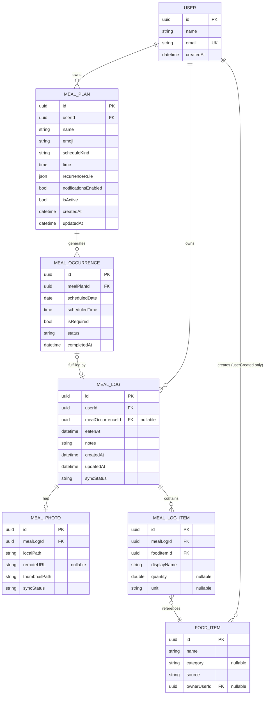

# 05 — Data Model

Este modelo asume persistencia local con **SwiftData** (ver ADR-003) como fuente de verdad local, sincronizada con un backend gestionado (ver ADR-004).

## ERD



## Tablas / modelos y tipos

### User

| Campo | Tipo | Notas |
|---|---|---|
| id | UUID (PK) | |
| name | String | |
| email | String (unique) | índice único |
| createdAt | Date | |

### MealPlan

| Campo | Tipo | Notas |
|---|---|---|
| id | UUID (PK) | |
| userId | UUID (FK → User) | índice |
| name | String | |
| emoji | String? | |
| scheduleKind | Enum(routine, oneTimeGoal, scheduledMeal) | ver 04-DOMAIN-MODEL §2.1 |
| time | Time? | solo relevante si scheduleKind == scheduledMeal |
| recurrenceRule | JSON embebido (value object) | ver 08 |
| notificationsEnabled | Bool | default false |
| isActive | Bool | default true |
| createdAt / updatedAt | Date | |

### MealOccurrence

| Campo | Tipo | Notas |
|---|---|---|
| id | UUID (PK) | |
| mealPlanId | UUID (FK → MealPlan) | índice compuesto con scheduledDate |
| scheduledDate | Date | índice (consultas por rango/día) |
| scheduledTime | Time? | |
| isRequired | Bool | default true |
| status | Enum(scheduled, completed, skipped, missed) | |
| completedAt | Date? | |

**Restricción**: no puede existir más de una `MealOccurrence` con el mismo `(mealPlanId, scheduledDate, scheduledTime)` — evita duplicados por recálculo de recurrencia.

### MealLog

| Campo | Tipo | Notas |
|---|---|---|
| id | UUID (PK) | |
| userId | UUID (FK → User) | índice |
| mealOccurrenceId | UUID? (FK → MealOccurrence) | índice; nulo = no planeada |
| eatenAt | DateTime | índice (consultas de historial por rango) |
| notes | String? | |
| createdAt / updatedAt | Date | |
| syncStatus | Enum(pendingUpload, synced, pendingDelete, conflict) | metadato de sincronización, no de dominio (ver 09) |

**Restricción**: si `mealOccurrenceId` no es nulo, la `MealOccurrence` referenciada debe pertenecer a un `MealPlan` cuyo `userId` coincida con `MealLog.userId` (regla de integridad aplicada a nivel de repositorio, no de base de datos, dado SwiftData).

### MealPhoto

| Campo | Tipo | Notas |
|---|---|---|
| id | UUID (PK) | |
| mealLogId | UUID (FK → MealLog, 1-a-0/1) | |
| localPath | String | ruta en almacenamiento local del dispositivo |
| remoteURL | String? | nulo hasta que se sincroniza |
| thumbnailPath | String | miniatura generada localmente |
| syncStatus | Enum(pendingUpload, synced, pendingDelete) | |

### MealLogItem

| Campo | Tipo | Notas |
|---|---|---|
| id | UUID (PK) | |
| mealLogId | UUID (FK → MealLog) | índice |
| foodItemId | UUID (FK → FoodItem) | índice |
| displayName | String | snapshot al momento de guardar (ver 04 §2.6) |
| quantity | Double? | |
| unit | String? | |

### FoodItem

| Campo | Tipo | Notas |
|---|---|---|
| id | UUID (PK) | |
| name | String | índice para búsqueda (full-text o prefijo) |
| category | String? | |
| source | Enum(local, remote, userCreated) | |
| ownerUserId | UUID? (FK → User) | nulo salvo `source == userCreated` |

## Datos derivados (NO persistidos)

* Estado de cumplimiento diario (`achieved` / `incomplete` / `neutral`) — calculado por `DailyComplianceCalculator` a partir de `MealOccurrence`.
* Emoji mostrado en el calendario de constancia — derivado del cálculo anterior + el `emoji` del `MealPlan` cumplido, no almacenado.
* Contadores de progreso del día ("2 de 3 completadas") — calculado en el ViewModel a partir de `MealOccurrence` del día.

## Índices recomendados

```text
MealPlan(userId)
MealOccurrence(mealPlanId, scheduledDate)
MealOccurrence(scheduledDate)              -- consultas de "hoy" y calendario
MealLog(userId, eatenAt)                   -- historial paginado por rango
MealLog(mealOccurrenceId)
FoodItem(name)                             -- búsqueda de alimentos
FoodItem(ownerUserId)                      -- aislar alimentos personalizados
```

## Nota sobre el backend remoto

Este modelo de datos se define de forma independiente de la tecnología de persistencia concreta. Localmente se recomienda SwiftData (ver ADR-003); remotamente, dependiendo de la decisión de ADR-004, este mismo modelo se traduce a colecciones/tablas equivalentes (por ejemplo, colecciones de Firestore o tablas de Postgres en Supabase). La forma relacional aquí mostrada es agnóstica al motor final.

