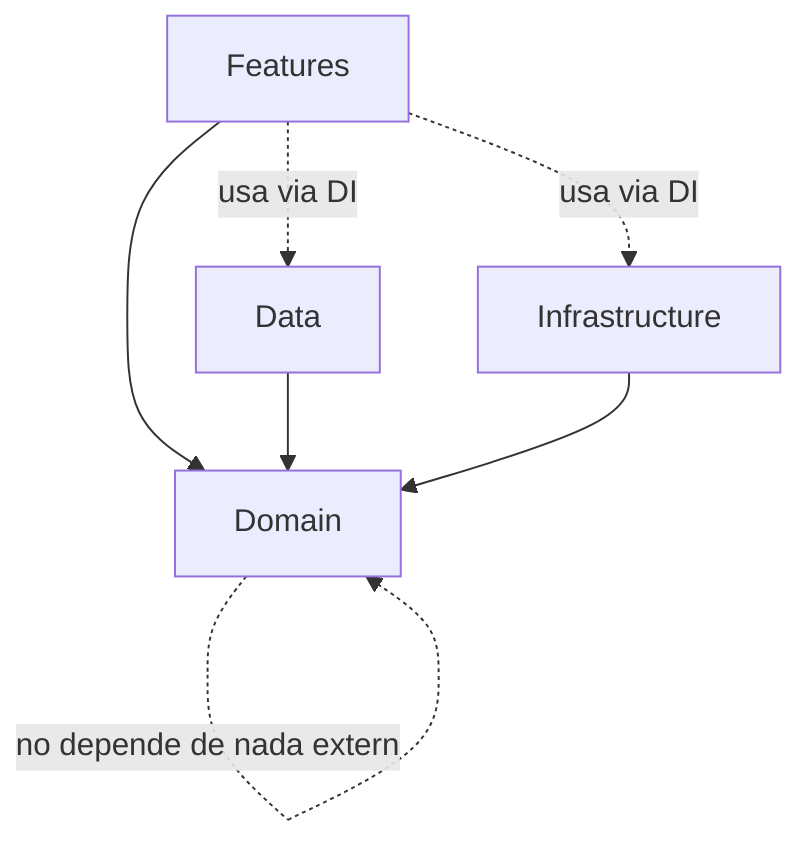

# 06 — Application Architecture

## Principio guía

Cada capa existe solo si resuelve un problema concreto de este producto. No se añade una capa "porque es una buena práctica general".

| Capa | Problema que resuelve |
|---|---|
| Features (SwiftUI + MVVM) | Aislar la UI y su estado por funcionalidad, para poder desarrollar/testear Authentication sin tocar MealLogging. |
| Domain (Models, UseCases, Repository protocols) | Definir las reglas de negocio (recurrencia, cumplimiento, invariantes) independientes de SwiftData/Firebase/etc., para poder cambiar de backend sin reescribir reglas. |
| Data (Repositories concretos, Local, Remote) | Traducir el dominio a SwiftData y a la API remota, y resolver sincronización, sin filtrar detalles de infraestructura al dominio. |
| Infrastructure (Auth, Notifications, Images, Sync) | Encapsular APIs de iOS/SDKs de terceros (UNUserNotificationCenter, PhotosPicker, SDK de auth) detrás de interfaces propias, para poder sustituirlas (ej. cambiar de proveedor de auth) sin tocar Features ni Domain. |
| Core | Utilidades transversales (extensions, DI container, tipos comunes) usadas por todas las capas anteriores. |

## Estructura de carpetas (corregida)

La estructura propuesta en el brief es razonable pero tenía una ambigüedad: `Data/Repositories` y `Domain/Repositories` sugieren dos cosas distintas con el mismo nombre. Se aclara así:

```text
App/
│
├── Core/
│   ├── DI/                     -- Contenedor de inyección de dependencias
│   ├── Extensions/
│   └── Utilities/
│
├── Domain/
│   ├── Models/                 -- Entidades y value objects puros (Swift structs/enums)
│   ├── UseCases/                -- Casos de uso que orquestan reglas de negocio no triviales
│   ├── Services/                -- DailyComplianceCalculator, RecurrenceEngine (servicios de dominio puros)
│   └── RepositoryProtocols/     -- Interfaces (protocols) que Data debe implementar
│
├── Data/
│   ├── Local/                   -- SwiftData models + mapeos
│   ├── Remote/                  -- Cliente API + DTOs
│   ├── Sync/                    -- Cola de sincronización, resolución de conflictos
│   └── RepositoryImplementations/ -- Implementaciones concretas de RepositoryProtocols
│
├── Infrastructure/
│   ├── Authentication/          -- Wrapper sobre el SDK de auth elegido
│   ├── Notifications/           -- Wrapper sobre UNUserNotificationCenter
│   ├── Images/                  -- Captura, compresión, miniaturas, caché
│   └── FoodCatalog/              -- LocalFoodCatalog, RemoteFoodCatalog, UserCreatedFoodCatalog
│
└── Features/
    ├── Authentication/           -- Views + ViewModels
    ├── Dashboard/
    ├── MealPlans/
    ├── MealLogging/
    ├── History/
    └── Profile/
```

**Corrección clave**: se renombra `Domain/Repositories` a `Domain/RepositoryProtocols` y `Data/Repositories` a `Data/RepositoryImplementations`, para que el nombre de la carpeta comunique inmediatamente la dirección de dependencia (Domain define el contrato, Data lo implementa). Esto evita la confusión de tener dos carpetas "Repositories" en capas distintas con significados distintos.

## Dirección de dependencias



Regla dura: **Domain no importa SwiftData, Firebase, ni ningún framework de UI o de red.** Domain solo define protocolos y modelos puros de Swift. Esto es lo que permite sustituir el backend (ADR-004) sin tocar las reglas de recurrencia o cumplimiento.

## Patrón MVVM + Use Cases (cuándo usar cada uno)

* **ViewModel**: mantiene el estado de una pantalla/feature y orquesta llamadas a Use Cases o directamente a un Repository cuando la operación es un simple CRUD sin regla de negocio relevante (ej. "obtener el perfil del usuario").
* **Use Case**: se introduce **solo** cuando hay una regla de negocio no trivial que orquesta más de un repositorio o aplica un cálculo del dominio. Ejemplos reales en este proyecto:
  * `SaveMealLogUseCase` (guarda el log, marca la occurrence como completed, dispara recálculo de cumplimiento).
  * `GenerateOccurrencesUseCase` (aplica `RecurrenceRule` para crear `MealOccurrence` futuras).
  * `CalculateDailyComplianceUseCase` (envuelve `DailyComplianceCalculator`).
* Se evita crear un Use Case por cada operación CRUD trivial (ej. "EditPlanNameUseCase") — eso sería sobreingeniería. Un ViewModel puede llamar directo a `MealPlanRepository.update(...)`.

## Repository Pattern

```text
protocol MealPlanRepository {
    func create(_ plan: MealPlan) async throws
    func update(_ plan: MealPlan) async throws
    func delete(id: MealPlan.ID) async throws
    func fetchActive(for userId: User.ID) async throws -> [MealPlan]
}
```

Cada Repository tiene una única implementación concreta en el MVP que internamente decide si lee de SwiftData (local, fuente de verdad) y encola cambios para sincronizar remotamente. La capa Features nunca sabe si el dato viene de local o remoto — eso es responsabilidad de la implementación del repositorio (ver 09-OFFLINE-AND-SYNC.md).

## Gestión de estado

* Estado de pantalla: `@Observable` ViewModels (Swift Observation framework), uno por Feature/pantalla.
* Estado compartido mínimo necesario (ej. sesión de usuario actual): un `AppSessionStore` inyectado vía DI, no un "estado global" difuso.
* Se evita un state-management framework de terceros tipo Redux/TCA para el MVP: la complejidad del dominio no lo justifica todavía. Si el proyecto crece mucho (por ejemplo con sincronización colaborativa en tiempo real), se puede reevaluar.

## Inyección de dependencias

Un contenedor de DI simple (no un framework externo pesado) que registra:

```text
AppContainer
    authService: AuthServiceProtocol
    mealPlanRepository: MealPlanRepository
    mealLogRepository: MealLogRepository
    foodCatalogRepository: FoodCatalogRepository
    notificationScheduler: NotificationSchedulerProtocol
    imageService: ImageServiceProtocol
    syncEngine: SyncEngineProtocol
```

Inyectado en las Views/ViewModels vía `@Environment` (SwiftUI) o inicializadores explícitos. Esto es suficiente para testear (se pueden inyectar mocks) sin adoptar un framework de DI de terceros.

## Concurrencia

* Swift Concurrency (`async/await`, `actor`) en toda la capa Data e Infrastructure.
* Los repositorios son `actor` cuando gestionan estado mutable compartido (ej. cola de sincronización) para evitar condiciones de carrera.
* Las ViewModels son `@MainActor` por defecto (actualizan UI).
* No se introduce Combine: Swift Concurrency cubre las necesidades actuales sin añadir un segundo paradigma reactivo.

## Diagrama de arquitectura (vista general)

```mermaid
flowchart TB
    subgraph UI[Features / SwiftUI Views]
    end
    subgraph VM[ViewModels]
    end
    subgraph UC[Domain: UseCases + Services]
    end
    subgraph RepoProto[Domain: RepositoryProtocols]
    end
    subgraph RepoImpl[Data: RepositoryImplementations]
    end
    subgraph Local[Data/Local: SwiftData]
    end
    subgraph Remote[Data/Remote: API Client]
    end
    subgraph Infra[Infrastructure: Auth, Notifications, Images]
    end

    UI --> VM
    VM --> UC
    VM --> RepoProto
    UC --> RepoProto
    RepoProto <-.implements.- RepoImpl
    RepoImpl --> Local
    RepoImpl --> Remote
    VM --> Infra
    UC --> Infra
```
