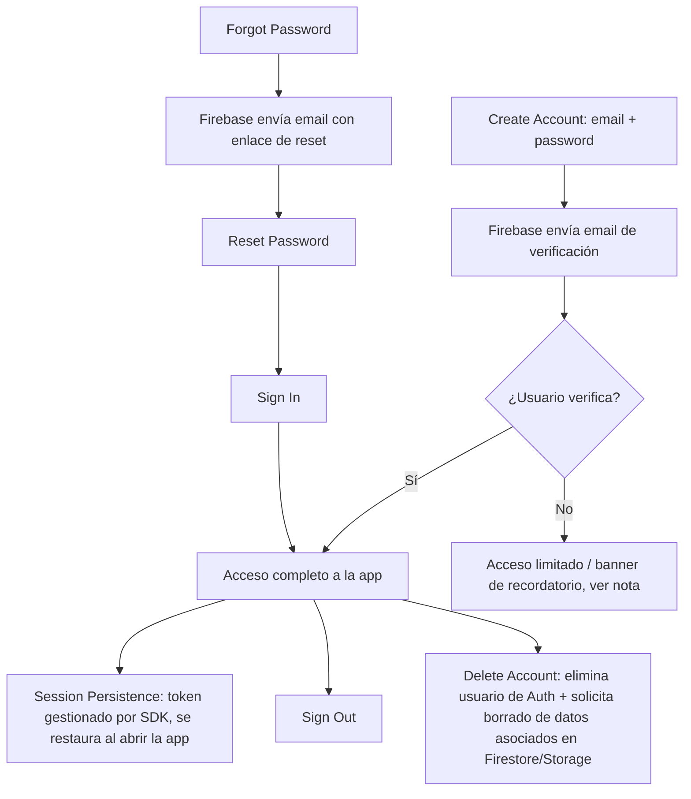

# 07 — Authentication Architecture

## Marco de la decisión

Se necesita: registro con email/password, verificación de email, login, recuperación de contraseña, persistencia de sesión, logout, eliminación de cuenta — **sin construir un backend propio desde cero**, con buena integración en Swift, y que además resuelva (o al menos no complique) base de datos, almacenamiento de imágenes y sincronización, ya que estas piezas suelen venir juntas en un BaaS (Backend-as-a-Service).

## Alternativas comparadas

| Opción | Complejidad inicial | Coste | Integración Swift | Auth completa | DB | Storage imágenes | Offline | Crecimiento |
|---|---|---|---|---|---|---|---|---|
| **Firebase (Auth + Firestore + Storage)** | Baja | Gratis en capa inicial, escala con uso | SDK oficial, buena documentación, comunidad enorme | Completa (email/password, verificación, reset incluidos) | Firestore (NoSQL, sync offline nativo) | Firebase Storage | Firestore tiene soporte offline nativo (persistencia + sync automática) | Bueno hasta escala media; posible lock-in de Google |
| **Supabase (Auth + Postgres + Storage)** | Baja-media | Gratis en capa inicial, escala con uso | SDK Swift oficial, algo menos maduro que Firebase pero activo | Completa (mismo set de features) | Postgres (relacional, más flexible para queries complejas) | Supabase Storage | No tiene sync offline nativo tan pulido como Firestore; requiere más trabajo propio de cola de sync | Muy bueno (Postgres da más flexibilidad de queries/migraciones que NoSQL) |
| **AWS Amplify (Cognito + AppSync/DynamoDB + S3)** | Alta | Gratis en capa inicial, pricing más complejo de predecir | SDK Swift disponible pero curva de aprendizaje mayor, más piezas que configurar | Completa pero más configuración manual | DynamoDB / AppSync (GraphQL) | S3 | AppSync con DataStore ofrece sync offline, pero es más pesado de configurar | Excelente a gran escala, pero sobredimensionado para un MVP individual |
| **Backend propio (Vapor/Node + Postgres + auth manual)** | Muy alta | Coste de servidor + coste de tiempo de desarrollo | Total control, pero cero aceleración | Hay que construir todo (verificación de email, reset, hashing, tokens) | Total control | Hay que montar S3-compatible o similar | Hay que construir el motor de sync a mano | Máximo control, pero el mayor coste de desarrollo y mantenimiento |
| **Sign in with Apple únicamente (sin email/password propio)** | Muy baja | Gratis | Nativo, excelente | No cubre "Create Account con email" pedido explícitamente ni recuperación de contraseña tradicional | N/A (necesitaría un BaaS igual para el resto) | N/A | N/A | Muy simple pero no cumple el requisito explícito de email/password + verificación |

## Decisión recomendada

**Firebase (Firebase Authentication + Firestore + Firebase Storage)** para el MVP.

### Justificación

* **Complejidad**: Firebase Auth resuelve de fábrica exactamente el flujo pedido (Create Account, Email Verification, Sign In, Forgot/Reset Password, Session Persistence, Sign Out, Delete Account) sin escribir backend propio.
* **Coste**: capa gratuita (Spark plan) cubre cómodamente el desarrollo y una base inicial de usuarios reales; el coste crece de forma predecible con uso.
* **Integración con Swift**: SDK oficial (`FirebaseAuth`, `FirebaseFirestore`, `FirebaseStorage`), soporte async/await ya disponible en versiones recientes del SDK.
* **Base de datos**: Firestore ofrece **persistencia offline nativa con sincronización automática al reconectar**, que es exactamente el requisito no funcional de "offline-first" del proyecto, y reduce drásticamente el trabajo de construir una cola de sincronización propia (aunque igual se necesita una capa fina de Domain/Repository para no acoplar el dominio a Firestore directamente — ver ADR-004 y 09-OFFLINE-AND-SYNC.md).
* **Almacenamiento de imágenes**: Firebase Storage se integra de forma natural con Auth (reglas de seguridad basadas en `uid`) para aislar fotos por usuario.
* **Sincronización / offline**: como se menciona arriba, es el punto más fuerte de Firebase frente a Supabase para este caso concreto.
* **Crecimiento**: es válido para el tamaño actual del producto (app individual); si en el futuro se necesitan queries relacionales complejas o control total de infraestructura, se puede migrar — el patrón Repository en Domain (ADR-004) ya aísla esta decisión para que un cambio de backend no obligue a reescribir Features ni Domain.

### Contras aceptados conscientemente

* Cierto lock-in con el ecosistema de Google.
* Firestore, al ser NoSQL orientado a documentos, requiere más disciplina de diseño para las queries de historial paginado por rango de fechas (se resuelve con subcollections e índices compuestos, ver 05-DATA-MODEL.md).

> **Alternativa a reconsiderar si el proyecto crece**: Supabase, por su modelo relacional (Postgres), sería preferible si en el futuro se necesitan reportes o queries analíticas complejas (Post-MVP: estadísticas de constancia). Esto se documenta como riesgo/revisión futura, no como decisión bloqueante ahora (ver ADR-002 y ADR-004).

## Flujos cubiertos

> **Nota / decisión pendiente**: si un usuario no verificado debe tener acceso bloqueado completamente o solo una advertencia persistente (FR-AUTH-003) es una decisión de producto, no técnica, y se deja abierta en la sección final de decisiones pendientes.

## Eliminación de cuenta — consideración importante

Eliminar el usuario de Firebase Auth **no elimina automáticamente** sus documentos en Firestore ni sus archivos en Storage. Se requiere:

1. Una Cloud Function (o proceso equivalente) disparada por la eliminación del usuario que borre en cascada sus `MealPlan`, `MealOccurrence`, `MealLog`, `MealPhoto` y `FoodItem` con `ownerUserId` propio.
2. Si no se quiere depender de Cloud Functions en el MVP (para minimizar piezas de backend), se puede hacer el borrado en cascada **desde el cliente antes de eliminar la cuenta**, aceptando el riesgo de que una desconexión a mitad de proceso deje datos huérfanos (mitigable con un job de limpieza posterior). Esta es una decisión pendiente (ver sección final).
