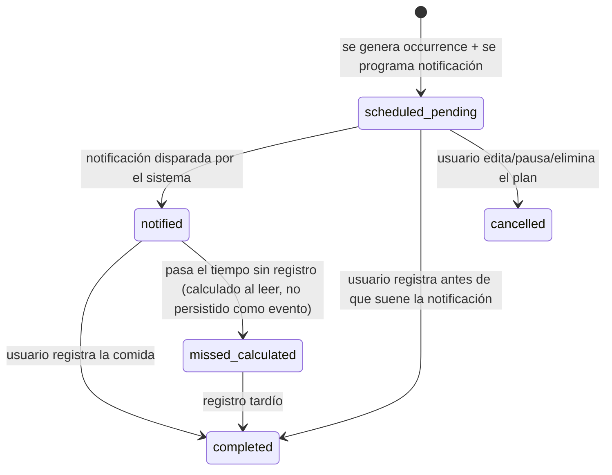

# 08 — Notifications and Recurrence

## Value object: RecurrenceRule

```text
RecurrenceRule
    kind: once | daily | specificDays
    daysOfWeek: Set<Weekday>?   // requerido solo si kind == specificDays
    startDate: Date
    endDate: Date?               // opcional; nil = indefinido
```

Se modela como **value object inmutable** dentro de `MealPlan`, no como entidad propia con su propio ID — no tiene identidad ni ciclo de vida independiente del plan que la contiene. Crear una entidad separada sería sobreingeniería para el MVP.

## Generación de `MealOccurrence`

No se generan ocurrencias "infinitas" por adelantado (eso sería trabajo y almacenamiento desperdiciado para reglas `daily` sin `endDate`). Se define una **ventana de generación móvil**:

```text
GenerateOccurrencesUseCase:
    ventana = hoy .. hoy + 30 días
    al abrir la app (o al crear/editar un plan):
        generar MealOccurrence faltantes dentro de la ventana
        para cada MealPlan activo (isActive == true)
```

Esto evita tanto la sobreingeniería de un "motor de recurrencia" complejo tipo iCalendar/RRULE completo, como el problema de quedarse sin ocurrencias futuras si el usuario no abre la app en mucho tiempo (se regenera la ventana cada vez que abre).

## ¿Cuándo solicitar permiso de notificaciones?

**No** al abrir la app por primera vez (mala práctica de UX, reduce tasa de aceptación). **Sí**, en el momento exacto en que el usuario activa por primera vez el toggle "notificaciones" en un `MealPlan` (FR-NOTIF-001). Si el usuario deniega el permiso, el toggle se muestra desactivado con un enlace a Ajustes, y el plan se guarda igualmente (sin notificaciones), sin bloquear el resto del flujo.

## Arquitectura del servicio de notificaciones

```text
protocol NotificationSchedulerProtocol {
    func schedule(for occurrence: MealOccurrence, plan: MealPlan) async
    func cancel(for occurrenceId: MealOccurrence.ID) async
    func rescheduleAll(for planId: MealPlan.ID) async
}
```

Implementación concreta (`Infrastructure/Notifications`) envuelve `UNUserNotificationCenter`.

### Identificador determinista (clave para evitar duplicados)

```text
notificationIdentifier = "\(mealOccurrence.id)"
```

Antes de programar, **siempre** se llama a `removePendingNotificationRequests(withIdentifiers:)` con ese mismo identificador. Esto hace la operación idempotente: programar dos veces la misma occurrence nunca duplica notificaciones.

### Qué ocurre en cada caso

| Evento | Acción sobre notificaciones |
|---|---|
| Editar un `MealPlan` (cambia hora, nombre o recurrencia) | Cancelar todas las notificaciones de `MealOccurrence` **futuras** (`scheduled`) del plan y reprogramar según la nueva configuración. Las ocurrencias ya `completed`/`skipped`/`missed` no se tocan. |
| Pausar un `MealPlan` (`isActive = false`) | Cancelar notificaciones futuras; no generar nuevas mientras esté pausado; no eliminar ocurrencias existentes. |
| Reactivar un plan pausado | Regenerar ventana de ocurrencias desde "hoy" y reprogramar notificaciones. |
| Eliminar un `MealPlan` | Cancelar notificaciones futuras y marcar/eliminar `MealOccurrence` en estado `scheduled` (las completadas se conservan como historial, sin notificación asociada porque ya ocurrieron). |
| Cambio de zona horaria del dispositivo | Las notificaciones locales programadas con `UNCalendarNotificationTrigger` y componentes de fecha/hora **naive** (sin zona horaria fija) siguen la zona horaria actual del dispositivo automáticamente. Se recomienda **no** fijar la zona horaria explícitamente al crear el trigger, para que iOS reajuste el disparo si el usuario viaja. Si se requiere un comportamiento distinto (ej. "la hora del plan es siempre en la zona horaria original"), es una decisión de producto pendiente — ver sección final. |

## Cálculo perezoso de `missed`

No se usa un job en background (BGTaskScheduler) solo para marcar ocurrencias vencidas como `missed`, porque añade complejidad de infraestructura para un beneficio menor. En su lugar:

```text
Al leer una MealOccurrence con status == scheduled:
    si scheduledDate/scheduledTime ya pasó:
        se presenta en UI como "missed" (calculado en el momento de lectura)
        el estado persistido puede actualizarse de forma oportunista en ese mismo momento
```

## Máquina de estados combinada (occurrence + notificación)


