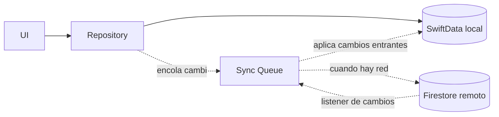

# 09 — Offline and Sync

## Fuente de verdad

**El almacenamiento local (SwiftData) es la fuente de verdad inmediata** para la experiencia del usuario. El backend remoto (Firestore, ver ADR-004) es la fuente de verdad **eventual/compartida** entre dispositivos. La app siempre lee y escribe primero contra local; la sincronización remota ocurre en segundo plano.



## Almacenamiento local

* SwiftData como base offline (ver ADR-003).
* Cada entidad de Data/Local incluye un campo `syncStatus` (no expuesto al Domain) para saber si necesita subir cambios.

## Almacenamiento remoto

* Firestore, estructurado en colecciones por usuario para simplificar reglas de seguridad y queries (`users/{uid}/mealPlans`, `users/{uid}/mealLogs`, etc.).

## Cola de sincronización

```text
SyncQueueEntry
    entityType: mealPlan | mealOccurrence | mealLog | mealPhoto | foodItem
    entityId
    operation: create | update | delete
    createdAt
    attemptCount
```

* Se persiste localmente (tabla propia en SwiftData), no en memoria, para sobrevivir cierres de la app.
* Un `SyncEngine` (actor) procesa la cola cuando detecta conectividad (usando `NWPathMonitor`), en orden FIFO por entidad.

## Conflictos

Dado que el MVP es de un único usuario en (probablemente) un único dispositivo activo a la vez, el riesgo de conflictos reales es bajo, pero se define una política simple para cuando ocurren (ej. el mismo usuario en dos dispositivos):

```text
Estrategia: Last-Write-Wins basado en updatedAt del servidor.
    Si el remoto tiene un updatedAt más reciente que el local pendiente de subir:
        se conserva la versión remota
        se marca la operación local en conflicto como descartada (no se reintenta)
    Excepción: MealLog y MealPhoto nunca se sobrescriben silenciosamente si ambas versiones
    tienen contenido distinto de forma sustancial (ej. fotos distintas) — se conserva ambas
    como entradas separadas antes que perder datos del usuario (evitar pérdida de registros reales).
```

Esta política se marca como **decisión inicial razonable, revisable** (ver ADR-006) — un esquema más sofisticado (CRDTs, vector clocks) sería sobreingeniería para el volumen y concurrencia reales de este producto.

## Reintentos

```text
attemptCount con backoff exponencial simple: 5s, 15s, 60s, 5min, luego reintento periódico cada 15min
tras N intentos fallidos consecutivos (ej. 5), se marca la entrada como "needsAttention"
y se expone (opcionalmente) un indicador discreto en Profile/Settings, sin bloquear el uso de la app.
```

## Errores

Estados de UI relacionados con sync (ver también 12 para testing):

```text
loading    -- cargando datos locales (debería ser casi instantáneo, dado que local es la fuente inmediata)
empty      -- sin datos aún (ej. usuario nuevo)
offline    -- sin conexión; la app sigue siendo completamente funcional para crear/editar/registrar
error      -- fallo no recuperable automáticamente (ej. error de permisos remotos)
syncing    -- indicador discreto (no bloqueante) de que hay cambios subiendo
retry      -- acción manual disponible para forzar un reintento de sync
```

Principio de diseño: **ninguna de las funciones principales (planificar, recordar, registrar, ver dashboard/calendario) debe bloquearse por falta de red.** Solo la sincronización entre dispositivos depende de la conectividad.
