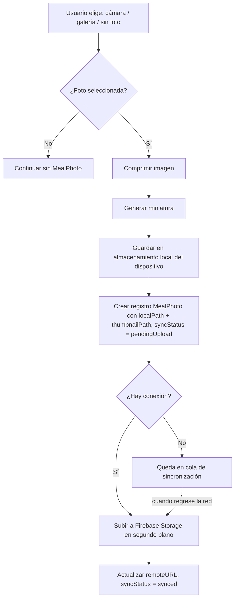
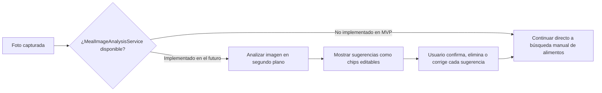

# 10 — Image Architecture

## Flujo de captura



## Compresión

* Redimensionar al lado mayor a un máximo razonable (ej. 1600px) antes de guardar localmente, para no consumir espacio de disco innecesario en fotos de comida (no se necesita resolución de estudio fotográfico).
* Compresión JPEG con calidad ~0.7–0.8 como punto de partida (ajustable, no es una decisión bloqueante para la arquitectura).

## Miniaturas

* Se genera una miniatura pequeña (ej. 200px) en el momento de guardar, usada en Dashboard/Historial/Calendario para evitar decodificar la imagen completa en listas con scroll.

## Almacenamiento y caché local

* Las imágenes (original comprimida + miniatura) se guardan en el sandbox de la app (`Application Support` o `Documents`, excluido de backup de iCloud si se desea ahorrar espacio de backup — decisión menor, no bloqueante).
* Un `ImageCache` simple en memoria (LRU) para miniaturas mostradas en listas, evitando releer disco constantemente durante el scroll.

## Sincronización

* Cada `MealPhoto` tiene su propio `syncStatus`, independiente del `MealLog` al que pertenece — una foto pesada puede tardar más en subir que el resto del registro (texto/ingredientes), y el registro debe verse "guardado" localmente de inmediato aunque la foto siga subiendo.

## Eliminación

* Al eliminar un `MealLog`, se elimina también su `MealPhoto` asociada: local inmediatamente, remota mediante una operación encolada (`delete`) en la cola de sincronización si ya se había subido.
* No se implementa "papelera" ni recuperación de fotos eliminadas en el MVP (sería sobreingeniería para esta etapa).

## Punto de extensión futuro: análisis de imágenes con IA

Se define la interfaz sin implementarla:

```text
protocol MealImageAnalysisService {
    func suggestFoodItems(from photo: MealPhoto) async throws -> [SuggestedFoodItem]
}

struct SuggestedFoodItem {
    let name: String
    let confidence: Double
}
```

### Cómo se integrará sin modificar el flujo actual de registro

En el flujo de registro (03-USER-FLOWS.md), justo después de "Tomar fotografía / elegir foto", se insertaría un paso **opcional** y no bloqueante:



Puntos clave de diseño que se preservan desde ahora:

* La IA **nunca** escribe directamente en `MealLogItem` — solo produce `SuggestedFoodItem`, que el usuario debe confirmar explícitamente antes de convertirse en un `MealLogItem` real. Esto mantiene la invariante "la IA nunca guarda automáticamente los ingredientes como verdad".
* La ausencia de una implementación real de `MealImageAnalysisService` en el MVP simplemente hace que ese paso se omita — no requiere ninguna rama condicional especial en `SaveMealLogUseCase`, porque la interacción con el servicio vive en la capa de Feature (ViewModel de registro), no en el caso de uso de guardado.
